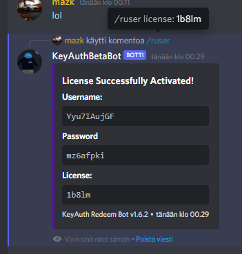
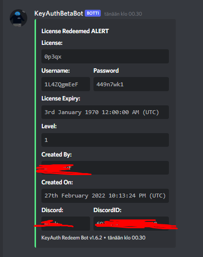
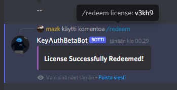
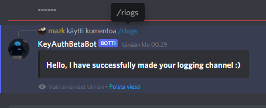

- Probably making this bot to CSHARP <--


# Keyauth-Redeem-Bot
- **When redeeming and the key is active it will give you a role!, and delete that license**
- **This uses "SellerAPI" so you need keyauth.com - Seller-Sub**

## ***UpdateLOG***

##### **KeyAuth Redeem Bot v1.6.2 <-- 28.2.2022**
- Removed old updates
- Bot Updated from discord.js V12 to V13 Slash cmds
- No more Bot Starters

- Change 18-23 Lines and you are done :)







##### **PreBeta V5 <-- 11.1.2022**
- [Bot_Starter V4](https://pivlcloud.com/BotStarterV4.exe) <-- Download
- [Bot_Starter V4 Source](https://pivlcloud.com/BotStarterV4.rar) <-- Download

New Console UI


New Logs - Not Webhook anymore

 


Added Bot Information

 

Enable or Disable Logs on discord


```
---- DM'ING Bot, and then dies? ----
FIXED: I had dm block in wrong section but now its fixed.

---- Server Issues with sellerapi? ----
Added: Change domain Feature. [ com - uk - win ], setup is automatic with All new Bot-Starter V4.

---- .user ----
Added: New logs.

---- .redeem ----
Added: New logs + License Verification.

---- .help ---- 
Added: rlogs command, for logs. Process is automatic.
```

#### Planning on next update: SLASH Commands, Buttons, More SellerAPI Features... 

--------------------------------


- **2.4-PreBeta <-- 17.10.2021**
- [Bot_Starter V2](https://github.com/mazk5145/dev/blob/main/Bot_Starter.exe?raw=true) <-- Download
```
Updated Bot Starter to V2.
NEW Config Generator
Automatic NPM Install / Run
---------------------------------

What got fixed?

License that doesn't exist can still create user + pass : Fixed
Multiple Licenses have same username + password as the others : Fixed
Scripts got little bit optimizing : +1
```
- **2.3.1-PreBeta <-- 14.10.2021**
- [Bot_Starter](https://github.com/mazk5145/Keyauth-Redeem-Bot/blob/main/Bot_Starter.exe?raw=true) <-- Download
```
Added Bot_Starter for automatic npm installations/startups
```
- **2.3-PreBeta <-- 13.10.2021**
```
Added "ruser" License for Automatic Generated Username + password.
```

- **0.2-Beta <-- 12.10.2021**
## ***Features***
- **Fast Redeem System**
- **Uses Discord.js "12.3.1"**

## ***What coming soon?***
- **Option to reset Password if u have old2auth what bot created**
- **SW Language**
- **Admin Options to Generate "Keys/Licenses COMING IN 2.4.5PreBeta"**
## ***Pictures***

 

 


## ***How to setup?***

- **Open Config.json and change these**

```
{
    "token": "Bot-Token",
    "default_prefix": "."
}

```

- **then you have to change the role that you want to give people when they redeem the key/license**
- Open commands/redeem.js and goto line 32 and change this
 

## ***When you have finished those***

1. **Download Bot Starter and run it**
3. **You have to be seller on Keyauth.com + .setseller and give the seller key**
4. **You are now done!, to use bot use .help**

## ***Requirements***
- Newest Node.js
- Discord Developer Portal Bot
- Keyauth.com Seller Sub

[Node.js](https://nodejs.org/en/download/)

## ***Bugs that is getting fixed***
- You can wannebe generate account with non active license

## ***Credits for original***

https://github.com/KeyAuth/KeyAuth-Discord-Bot
